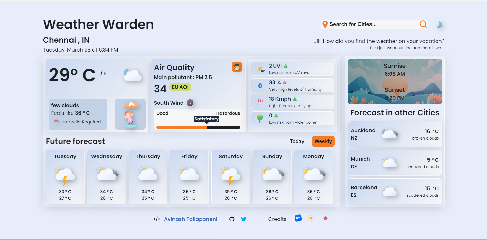

# Weather Warden

## Introduction

The Weather Warden is a web application that provides users with up-to-date weather information for their desired location. This project is part of my journey to become a front-end web developer, and it incorporates APIs from OpenWeatherMap and Open-Meteo to fetch weather data and icons from Meteocons by Bas Milius to display the weather conditions.

## Features

* Users can search for the weather conditions in their desired location by entering the city name or by pressing location button.
* The application displays the current weather condition, temperature, Air Quality, UV-Index, humidity, wind speed, Pollen count and wind direction.
* The application also provides a seven-day weather forecast for the location.
* Weather jokes are displayed every 7 seconds.
* Random cities forecast is displayed.
* On page reload application retrives last search location and displays its current weather information.
* The icons used to display weather conditions are easy to understand and visually appealing.
* The application is responsive and can be used on different screen sizes.

## Technologies Used
The Weather Warden is built using HTML, CSS, and JavaScript. It uses APIs from OpenWeatherMap and Open-Meteo to fetch weather data and Meteocons icons to display the weather conditions. The application is hosted on Netlify.

## Screenshot

## Author

My name is Avinash Tallapaneni, and I am a front-end web developer based in Chennai, India. I am passionate about coding and building applications that make a difference in people's lives.

- Website - [Preview site on netlify](https://weather-warden.netlify.app/)
- Twitter - [@TallapaneniAvi](https://www.twitter.com/TallapaneniAvi)

## Got feedback?

i love receiving feedback! So if you have anything you'd like to mention, please email avinashtallapaneni[at]gmail[dot]com or message me on socials
